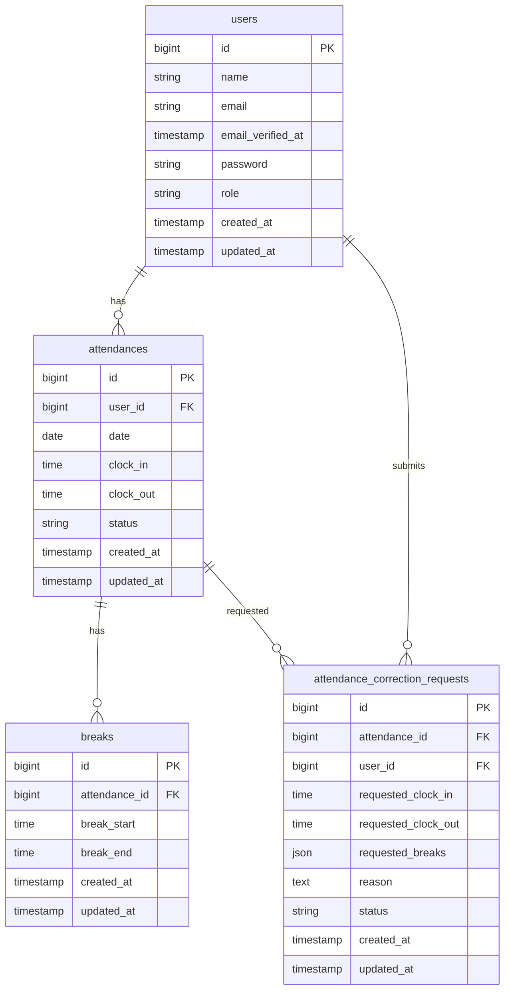

## ER図

```mermaid
erDiagram

users {
  bigint id PK
  string name
  string email
  timestamp email_verified_at
  string password
  string role
  timestamp created_at
  timestamp updated_at
}

attendances {
  bigint id PK
  bigint user_id FK
  date date
  time clock_in
  time clock_out
  string status
  timestamp created_at
  timestamp updated_at
}

breaks {
  bigint id PK
  bigint attendance_id FK
  time break_start
  time break_end
  timestamp created_at
  timestamp updated_at
}

attendance_correction_requests {
  bigint id PK
  bigint attendance_id FK
  bigint user_id FK
  time requested_clock_in
  time requested_clock_out
  json requested_breaks
  text reason
  string status
  timestamp created_at
  timestamp updated_at
}

users ||--o{ attendances : has
attendances ||--o{ breaks : has
attendances ||--o{ attendance_correction_requests : requested
users ||--o{ attendance_correction_requests : submits
```